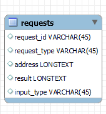

# NJCCIC Cyber Analyst Toolkit
A toolkit to aid the New Jersey Cybersecurity and Communications Integration Cell (NJCCIC) in gathering information about vulnerable IP addresses. [Demo](https://www.youtube.com/watch?v=BXNTtAZyELI)

## Installation and Setup
Run `installations.py` in the `scripts` folder or manually install the following libraries:
* mysql-connector-python
* ipwhois
* python-dotenv
* bs4
* requests
* googlesearch-python
* lxml
* geopy

We used an AWS EC2 server with LAMP set up. Detailed instructions can be found [here](https://docs.aws.amazon.com/AWSEC2/latest/UserGuide/ec2-lamp-amazon-linux-2.html)

Create a `.env` file with the following variables for the SQL database:
```
HOST="[sql_host_name]"
USER="[sql_username]"
PASSWORD="[sql_password]"
DATABASE="[sql_database_name]"
```

The database should use a schema as follows:



MySQL is recommended for setting up the database.

To set up the cron job, SSH into the server and run `crontab -e`. On the first line, write `* * * * * /usr/bin/python3 /var/www/html/capstone_prototype/scripts/big_script.py`. This will make `big_script.py` run every minute.

## Usage
The user can navigate to the various tools by clicking the appropriate tabs on the sidebar. The tools have two main input methods:
1. Single Input
   1. The user pastes a single IP address into the box on the webpage. The results are printed on the following HTML page
2. File Input
   1. The user uploads a `.txt` file of IP addresses (separated by new lines). The results are outputted in a downloadable `.csv` file that the user is able to name
